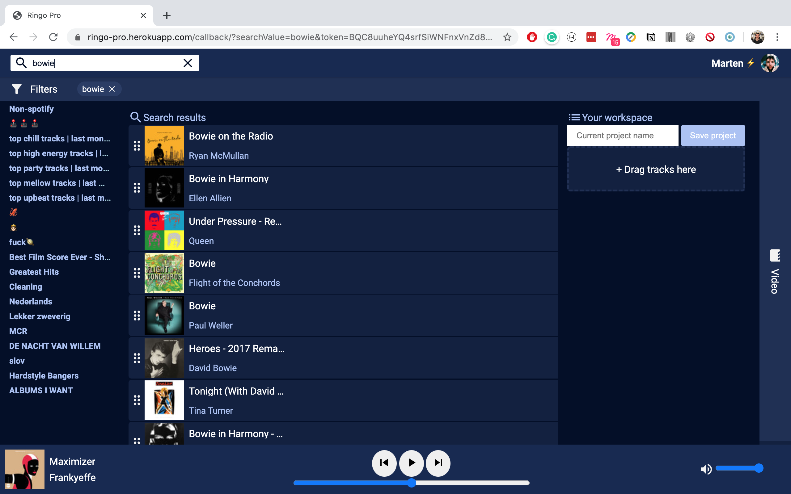

# Ringo.Pro



## Introduction

Ringo Pro is a application for music supervisors. It makes looking for tracks and searching for music licenses easier. This project is a proof of concept prototype which illustrates the possibilities of this application.

## Table of contents

- [Working features](#working-features)
- [Installation](#installation)
- [NPM Scripts](#npm-scripts)
- [Dependencies](#dependencies)
- [API](#api)
- [Credits](#credits)
- [Sources](#sources)

## Working featues

* Projects(Spotify playlists for now) in the left side bar which are clickable, and will show tracks in the playlist

* Search

* Detailed information about tracks

* Draggable search results to temporarily save chosen tracks

* Music player
  * Music can be played and paused using the webplayer
  * It's possible to search in a track by scrubbing iver the track timeline
  * The volume of the track can be adjusted


## Installation

### 1. Clone the repo and install dependencies

```zsh
git clone https://github.com/Ringo-Pro/Ringo.Pro.git
cd Ringo.Pro
npm install
```

### 2. Make an .env file

To make the application work you will need to make a `.env` file in the root folder. Here you must add:

- Client ID from Spotify
- Client Secret from Spotify
- Redirect URI (for Spotify)

```
SPOTIFY_CLIENT_ID=<YOUR_CLIENT_ID>
SPOTIFY_CLIENT_SECRET=<YOUR CLIENT SECRET>
REDIRECT_URI=<YOUR_REDIRECT_URI>
```

### 3. Run the app

```zsh
npm start
```

or run the app in development mode

```zsh
npm run start:dev
```

## NPM Scripts

- `npm run prestart` = Build CSS before starting
- `npm run start` = Start the app
- `npm run dev` = Start the app with Nodemon
- `npm run start:dev` = Start the app in development mode (watch + dev)
- `npm run build:css` = Build CSS
- `npm run build:js` = Build ES
- `npm run build:img` = Build IMG
- `npm run build` = Build CSS + ES + IMG
- `npm run watch` = Watch CSS + ES Files
- `npm run deploy` = Deploy to Heroku
- `npm run logs` = Show Heroku logs

## Dependencies

- [NodeJS](https://nodejs.org/en/)
- [Express](https://www.npmjs.com/package/express)
  - [Body Parser](https://www.npmjs.com/package/body-parser)
  - [Cookie Parser](https://www.npmjs.com/package/cookie-parser)
- [Cors](https://www.npmjs.com/package/cors)
- [DotENV](https://www.npmjs.com/package/dotenv)
- [EJS](https://www.npmjs.com/package/ejs)
- [Gulp](https://www.npmjs.com/package/gulp)
  - [Gulp Autoprefixer](https://www.npmjs.com/package/gulp-autoprefixer)
  - [Gulp Clean CSS](https://www.npmjs.com/package/gulp-clean-css)
  - [Gulp Concat](https://www.npmjs.com/package/gulp-concat)
  - [Gulp Imagemin](npmjs.com/package/gulp-imagemin)
  - [Gulp Terser](https://www.npmjs.com/package/gulp-terser)
- [Node Fetch](https://www.npmjs.com/package/node-fetch)
- [Query String](https://www.npmjs.com/package/query-string)
- [Url](https://www.npmjs.com/package/url)
- [Nodemon](npmjs.com/package/nodemon)

## API

### Spotify API

[Documentation](https://developer.spotify.com/documentation/web-api/)

The Spotify api makes use of a oAuth flow. In order to get data from the Spotify endpoints you have to go through the basice flow.
The endpoints used in this prototype:

- https://api.spotify.com/v1/me - gets the current users Spotify profile

```js
//request:
await getDataFromSpotfy(`https://api.spotify.com/v1/me`, options)
//returned data:
{
   "country":"SE",
   "display_name":"JM Wizzler",
   "email":"email@example.com",
   "external_urls":{
      "spotify":"https://open.spotify.com/user/wizzler"
   },
   "followers":{
      "href":null,
      "total":3829
   },
   "href":"https://api.spotify.com/v1/users/wizzler",
   "id":"wizzler",
   "images":[
      {
         "height":null,
         "url":"https://fbcdn-profile-a.akamaihd.net/hprofile-ak-frc3/t1.0-1/1970403_10152215092574354_1798272330_n.jpg",
         "width":null
      }
   ],
   "product":"premium",
   "type":"user",
   "uri":"spotify:user:wizzler"
}
```

- https://api.spotify.com/v1/me/playlists - gets a list with the current users playlists

```js
//request:
await getDataFromSpotfy(`https://api.spotify.com/v1/me/playlists`, options)
//returned data:
{
   "href":"https://api.spotify.com/v1/users/wizzler/playlists",
   "items":[
      {
         "collaborative":false,
         "external_urls":{
            "spotify":"http://open.spotify.com/user/wizzler/playlists/53Y8wT46QIMz5H4WQ8O22c"
         },
         "href":"https://api.spotify.com/v1/users/wizzler/playlists/53Y8wT46QIMz5H4WQ8O22c",
         "id":"53Y8wT46QIMz5H4WQ8O22c",
         "images":[

         ],
         "name":"Wizzlers Big Playlist",
         "owner":{
            "external_urls":{
               "spotify":"http://open.spotify.com/user/wizzler"
            },
            "href":"https://api.spotify.com/v1/users/wizzler",
            "id":"wizzler",
            "type":"user",
            "uri":"spotify:user:wizzler"
         },
         "public":true,
         "snapshot_id":"bNLWdmhh+HDsbHzhckXeDC0uyKyg4FjPI/KEsKjAE526usnz2LxwgyBoMShVL+z+",
         "tracks":{
            "href":"https://api.spotify.com/v1/users/wizzler/playlists/53Y8wT46QIMz5H4WQ8O22c/tracks",
            "total":30
         },
         "type":"playlist",
         "uri":"spotify:user:wizzler:playlist:53Y8wT46QIMz5H4WQ8O22c"
      },
      {
         "collaborative":false,
         "external_urls":{
            "spotify":"http://open.spotify.com/user/wizzlersmate/playlists/1AVZz0mBuGbCEoNRQdYQju"
         },
         "href":"https://api.spotify.com/v1/users/wizzlersmate/playlists/1AVZz0mBuGbCEoNRQdYQju",
         "id":"1AVZz0mBuGbCEoNRQdYQju",
         "images":[

         ],
         "name":"Another Playlist",
         "owner":{
            "external_urls":{
               "spotify":"http://open.spotify.com/user/wizzlersmate"
            },
            "href":"https://api.spotify.com/v1/users/wizzlersmate",
            "id":"wizzlersmate",
            "type":"user",
            "uri":"spotify:user:wizzlersmate"
         },
         "public":true,
         "snapshot_id":"Y0qg/IT5T02DKpw4uQKc/9RUrqQJ07hbTKyEeDRPOo9LU0g0icBrIXwVkHfQZ/aD",
         "tracks":{
            "href":"https://api.spotify.com/v1/users/wizzlersmate/playlists/1AVZz0mBuGbCEoNRQdYQju/tracks",
            "total":58
         },
         "type":"playlist",
         "uri":"spotify:user:wizzlersmate:playlist:1AVZz0mBuGbCEoNRQdYQju"
      }
   ],
   "limit":9,
   "next":null,
   "offset":0,
   "previous":null,
   "total":9
}
```

- https://api.spotify.com/v1/search?q=${req.query.query}&type=track%2Cartist&limit=10&offset=0 - used to search for tracks and artists

* https://api.spotify.com/v1/audio-features/${song.id} - used to get the features of a track

### Spotify web playback SDK

In order to make a custom music player Spotify made something called the web playback SDK. This is a library which you can easily use to plat spotify tracks whithin your own web application. We made use of the following events:

- Initialise the player:

```js
window.onSpotifyWebPlaybackSDKReady = () => {
  // here is wehere all events related to the SDK live
};
```

- getCurrentState:

```js
player.getCurrentState().then((state) => {
  if (!state) {
    // nowPlaying.children[0].textContent = 'Click on a song!'
    // console.error('User is not playing music through the Web Playback SDK')
    console.log('User is not playing music through the Web Playback SDK');
    fetch('https://api.spotify.com/v1/me/player', {
      method: 'GET',
      headers: {
        'Content-Type': 'application/json',
        Authorization: `Bearer ${token}`,
      },
    })
      .then((res) => res.json())
      .then((body) => {
        console.log(body);
        nowPlaying.children[0].textContent = body.item.name;
        nowPlaying.children[1].textContent = body.item.artists[0].name;

        albumArt.src = body.item.album.images[2].url;
      });

    return;
  }

  let {
    current_track,
    next_tracks: [next_track],
  } = state.track_window;

  console.log('Currently Playing', current_track);
  console.log('Playing Next', next_track);
});
```

- Player state changed:

```js
let currState = {};
player.addListener('player_state_changed', (state) => {
  currState.paused = state.paused;
  currState.position = state.position;
  currState.duration = state.duration;
  currState.updateTime = performance.now();
  currState.current_track = state.track_window.current_track;
});
```

- Changing volume:

```js
volume.addEventListener('mouseup', function () {
  player.setVolume(this.value).then(() => {
    console.log('volume updated to: ', this.value);
  });
});
```

- Play and pause toggling:

```js
pauseButton.addEventListener('click', (event) => {
  player.togglePlay().then(() => {});
});
```

- Seeking in a track:

```js
trackProgression.addEventListener('mouseup', function () {
  // console.log('yeet: ', this.value)
  player.seek(this.value).then(() => {
    console.log('Changed position!');
  });
});
```

## Credits

- Jo Sandow for supporting us during this project.
- Marcel Alexander Wiebenga for thinking of this project.
- [CSS Reset by Meyerweb](http://meyerweb.com/eric/tools/css/reset/) for their CSS reset
- [Danrovito - Country dropdown](https://gist.github.com/danrovito/977bcb97c9c2dfd3398a) for saving us a lot of time.
- [Peter-Paul Koch - checking input types with JS](https://quirksmode.org/html5/inputs/tests/inputs_js.html) for his code to check if a browser supports an input type.
- [Thomas Loven](https://github.com/thomasloven/round-slider) for making round sliders.
- [Google Material Icons](https://material.io/resources/icons/?style=baseline)

## Wishlist

- [ ] Cool visual graphs
- [ ] Make a new playlist with chosen tracks
- [ ] Show track lyrics in information screen
- [ ] Make data visualisations of track stats
- [ ] Better filtering

## Sources

📖 Artikel / Documentation **|** ⚙️ Code **|** 📹 Video **|** 🛠 Tools

- 📖 [Spotify API Documentation](https://developer.spotify.com/documentation/web-api/)
- 🛠 [RegEx Tool](https://regexr.com/)
- 📖 [The fundamental music genre list - Dan Gravell - Blisshq.com](https://www.blisshq.com/music-library-management-blog/2011/01/25/fundamental-music-genre-list/)
- 📖 [An Efficient Classification Algorithm for Music Mood Detection in Western and Hindi Music Using Audio Feature Extraction - published 2014](https://www.semanticscholar.org/paper/An-Efficient-Classification-Algorithm-for-Music-in-Bhat-Amith/864fe699dfd0e7696d532d03c6b99b5a5583c8c9)
- 📖 [Novel audio features for music emotion recognition - published March 2018](https://www.researchgate.net/publication/324093990_Novel_audio_features_for_music_emotion_recognition)
- 📖 [How JavaScript works: tracking changes in the DOM using MutationObserver - Alexander Zlatkov - Medium](https://blog.sessionstack.com/how-javascript-works-tracking-changes-in-the-dom-using-mutationobserver-86adc7446401)
- 📖 [Quick Reminder that Details/Summary is the Easiest Way Ever to Make an Accordion - Chris Coyier - CSS-Tricks](https://css-tricks.com/quick-reminder-that-details-summary-is-the-easiest-way-ever-to-make-an-accordion/)
